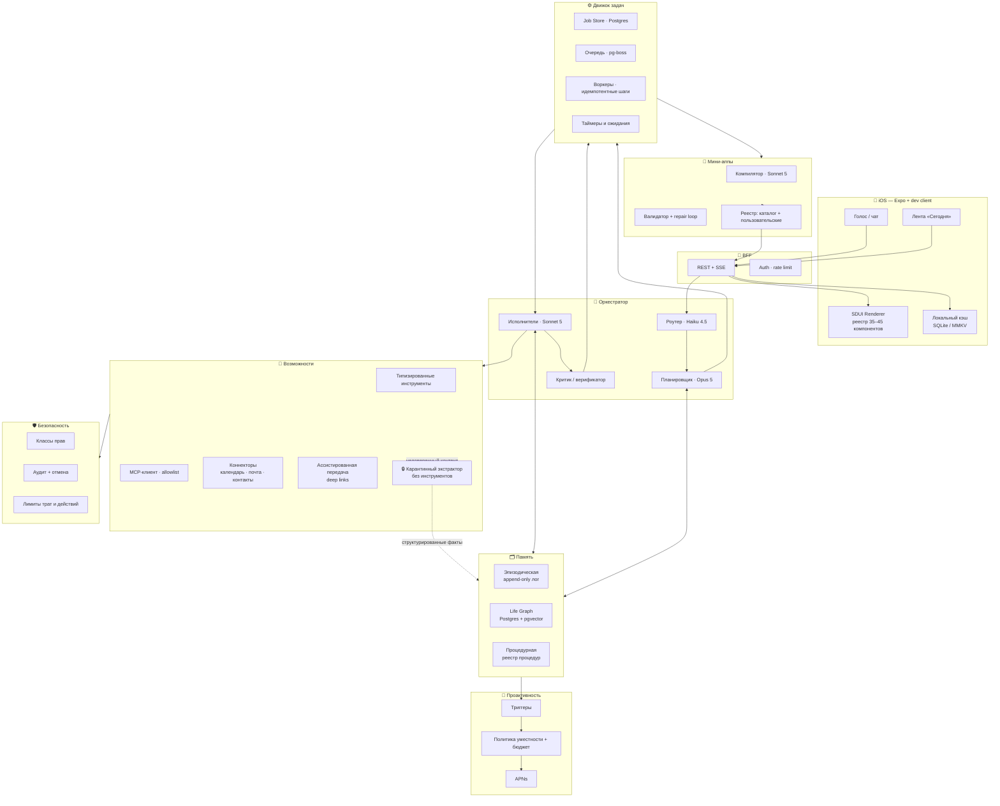
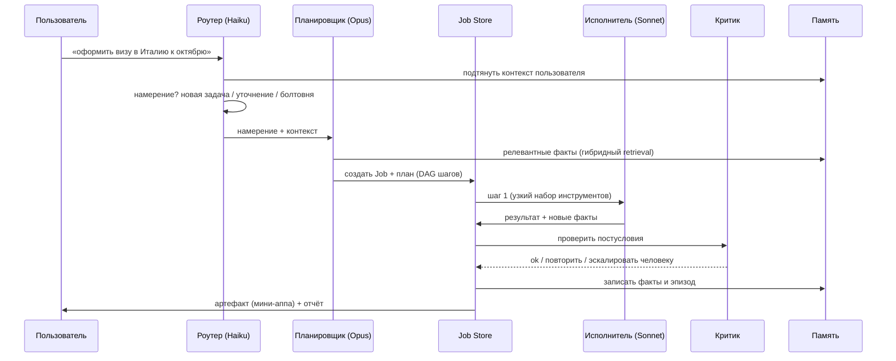
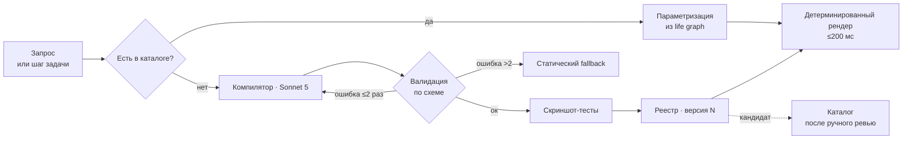
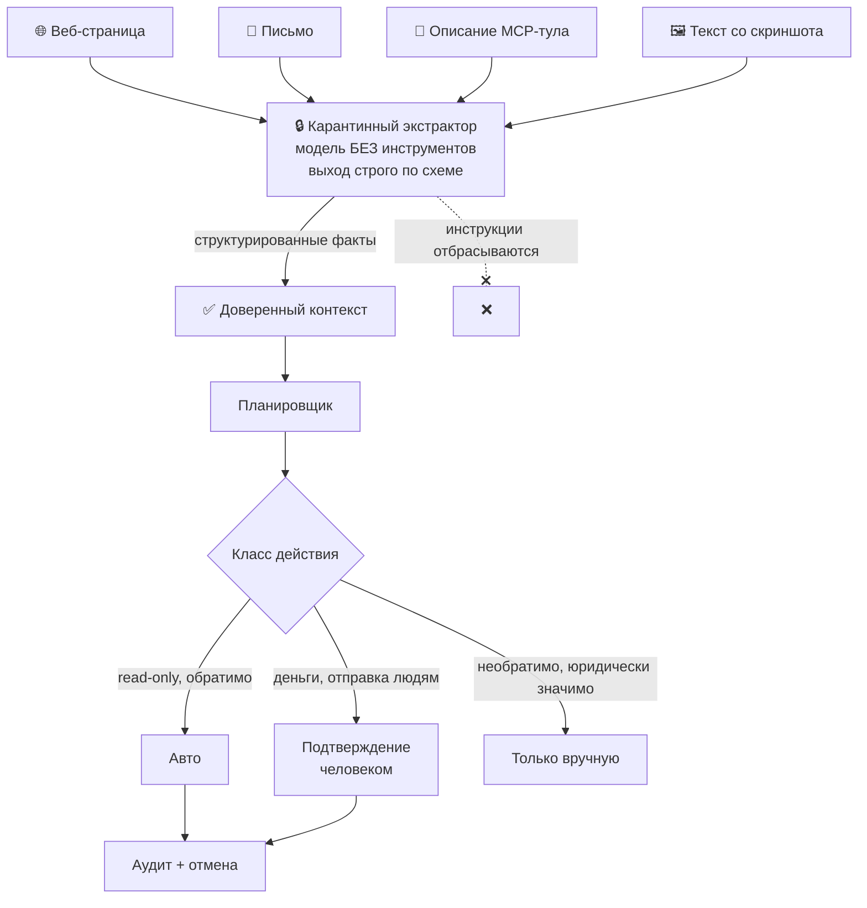

# Архитектура MVP

## 1. Общая схема



> Схема логическая. Физически всё серверное — **один деплой**: блоки выше это модули внутри `apps/api`, а не отдельные сервисы (см. §10).

---

## 2. Стек

| Слой | Выбор | Обоснование |
|---|---|---|
| Клиент | Expo SDK + `expo-dev-client`, expo-router, TypeScript | нужны кастомные нативные модули; Expo Go не подходит |
| Локальное хранилище | SQLite (expo-sqlite) + MMKV | мгновенное открытие ленты офлайн |
| BFF | Node 22 + Hono, SSE для стриминга | один язык с клиентом, низкий оверхед |
| Оркестратор | TypeScript, Anthropic SDK, tool use, prompt caching | нет причины разделять языки на этом объёме |
| Модели | Haiku 4.5 / Sonnet 5 / Opus 5 по роутингу | цена-качество по классам задач |
| Задачи | Postgres + pg-boss → Temporal при росте | простота сейчас, механическая миграция потом |
| Данные | Postgres 16 + pgvector, S3-совместимое хранилище | одна база, обычные транзакции и бэкапы |
| Кэш | Redis | сессии, rate limit, горячий UISpec |
| Наблюдаемость | OpenTelemetry + Langfuse | трассировка + LLM-специфика и эвалы |
| Секреты | KMS + envelope-шифрование на пользователя | компрометация БД ≠ компрометация токенов |
| Хостинг | РФ-регион, управляемые сервисы | 152-ФЗ и локализация персданных; соло-режим — никакого k8s |

---

## 3. Оркестратор: пять ролей, не один агент

Монолитный ReAct-луп на такой системе неуправляем. Разделяем по ролям — каждая со своей моделью, своим контекстом и своим набором инструментов.



**Правила, которые держат систему в рамках:**

1. **Планировщик не вызывает инструменты.** Он только строит план. Это делает его дешёвым в отладке и невосприимчивым к инъекциям через результаты инструментов.
2. **Исполнитель получает узкий набор инструментов** — только те, что нужны его шагу. Наименьшие привилегии на уровне шага, не задачи.
3. **Критик проверяет постусловия** и решает: принять, повторить, эскалировать человеку. Без критика агент уверенно рапортует об успехе там, где ничего не сделал.
4. **Карантинный экстрактор** — единственный, кто видит сырой недоверенный текст (письма, веб-страницы, OCR). У него нет ни одного инструмента, и он возвращает только структуру по схеме.

---

## 4. Модель данных

### 4.1. Life Graph

```sql
-- Сущность: человек, место, организация, вещь, документ, обязательство...
CREATE TABLE entity (
  id            uuid PRIMARY KEY,
  user_id       uuid NOT NULL,
  type          text NOT NULL,          -- person | place | org | thing | doc | account | recurring | goal | constraint
  label         text NOT NULL,
  attrs         jsonb NOT NULL DEFAULT '{}',
  embedding     vector(1024),
  created_at    timestamptz NOT NULL DEFAULT now(),
  archived_at   timestamptz
);

-- Факт/ребро: с провенансом и битемпоральностью
CREATE TABLE fact (
  id            uuid PRIMARY KEY,
  user_id       uuid NOT NULL,
  subject_id    uuid NOT NULL REFERENCES entity(id) ON DELETE CASCADE,
  predicate     text NOT NULL,          -- works_at | lives_in | owns | prefers | due_on | child_of ...
  object_id     uuid REFERENCES entity(id) ON DELETE CASCADE,
  object_value  jsonb,                  -- literal, если объект не сущность

  -- провенанс: без этого ассистент не может ответить «откуда ты это взял»
  source        text NOT NULL,          -- user_said | calendar | email | inferred | procedure
  source_ref    text,
  confidence    real NOT NULL DEFAULT 0.7,
  observed_at   timestamptz NOT NULL,   -- когда МЫ узнали

  -- битемпоральность: жизненные факты меняются
  valid_from    timestamptz,            -- когда факт стал истинным
  valid_to      timestamptz,            -- когда перестал (NULL = актуален)

  superseded_by uuid REFERENCES fact(id),
  embedding     vector(1024)
);

CREATE INDEX ON fact (user_id, subject_id, predicate) WHERE valid_to IS NULL;
CREATE INDEX ON fact USING hnsw (embedding vector_cosine_ops);
```

**Разрешение конфликтов** (порядок применения):
1. Прямое утверждение пользователя бьёт любой вывод.
2. Более свежее наблюдение бьёт старое при равном источнике.
3. При конфликте с высокой уверенностью с обеих сторон — старый факт закрывается (`valid_to`), новый пишется, а вопрос ставится в очередь «спросить в подходящий момент» — не немедленно.
4. Ничего не удаляем физически: `superseded_by` сохраняет историю. Ассистент должен уметь сказать «раньше ты говорил иначе».

**Гибридный retrieval** — четыре сигнала, а не только вектор:

```
score = w1·структурная релевантность (тип, предикат, связь с задачей)
      + w2·векторная близость
      + w3·свежесть (экспоненциальное затухание)
      + w4·важность (частота обращений, ручное закрепление)
```

### 4.2. Задача

```sql
CREATE TABLE job (
  id             uuid PRIMARY KEY,
  user_id        uuid NOT NULL,
  goal           text NOT NULL,
  status         text NOT NULL,   -- planning | running | waiting_user | waiting_world | done | failed | cancelled
  plan           jsonb NOT NULL,  -- DAG шагов
  cursor         jsonb NOT NULL,  -- где мы сейчас
  artifacts      jsonb NOT NULL DEFAULT '[]',
  budget_spent   jsonb NOT NULL DEFAULT '{}',
  wake_at        timestamptz,     -- для ожиданий
  created_at     timestamptz NOT NULL DEFAULT now(),
  updated_at     timestamptz NOT NULL DEFAULT now()
);

CREATE TABLE job_step (
  id               uuid PRIMARY KEY,
  job_id           uuid NOT NULL REFERENCES job(id) ON DELETE CASCADE,
  idx              int  NOT NULL,
  tool             text NOT NULL,
  args             jsonb NOT NULL,
  idempotency_key  text NOT NULL UNIQUE,   -- защита от двойного выполнения
  status           text NOT NULL,
  result           jsonb,
  compensation     jsonb,                  -- как откатить
  attempts         int NOT NULL DEFAULT 0,
  UNIQUE (job_id, idx)
);
```

**Почему именно так:** шаг — детерминированная функция от состояния, все побочные эффекты идут через инструменты с ключом идемпотентности. Это делает миграцию на Temporal механической, а ретраи — безопасными.

### 4.3. Процедура (процедурная память)

```sql
CREATE TABLE procedure (
  id             uuid PRIMARY KEY,
  user_id        uuid,               -- NULL = общая, обезличенная
  name           text NOT NULL,
  trigger_spec   jsonb NOT NULL,     -- когда применима
  params_schema  jsonb NOT NULL,     -- что нужно спросить/взять из графа
  steps          jsonb NOT NULL,
  postconditions jsonb NOT NULL,     -- как понять, что сработало
  compensation   jsonb,
  success_rate   real,
  runs           int NOT NULL DEFAULT 0,
  status         text NOT NULL       -- draft | verified | quarantined
);
```

Разделение `user_id = NULL` (общий скелет) и пользовательских параметров заложено сразу — иначе потом невозможно распутать личные данные при переиспользовании процедур между пользователями.

---

## 5. Мини-аппы: жизненный цикл



**Ключевые правила:**

- Генерация — событие создания, не операция рендера.
- Пользователь никогда не видит сломанный экран: repair loop, затем fallback.
- Успешная сгенерированная аппа становится **кандидатом в каталог** — после обезличивания и ревью. Так каталог растёт сам, а предельная стоимость падает.
- Один и тот же `UISpec` рендерится и в iOS, и в вебе (шаринг — контур роста).

---

## 6. Безопасность: как выглядит «правило двух» в коде



**Классы прав инструментов** — атрибут манифеста, а не решение модели:

| Класс | Примеры | Требование |
|---|---|---|
| `auto` | поиск, чтение календаря, расчёты, генерация черновика | без подтверждения |
| `confirm` | отправка письма/сообщения, запись на приём, создание события у других людей | тап пользователя |
| `never` | платежи, удаление данных, юридически значимые действия | вне автоматизации в MVP |

Дополнительно: allowlist адресатов (только контакты из графа), лимиты (писем в день, вызовов на задачу, рублей в месяц), полный аудит с человекочитаемым «что и почему» и кнопкой отмены.

---

## 7. Проактивность

```
Событие (время | гео | коннектор | изменение факта | дедлайн | ожидаемого действия не было)
  → Кандидат уведомления
  → Оценка: важность × срочность × P(полезно) × уместность времени × давность последнего
  → Бюджет ≤3 в день, приоритетное вытеснение
  → Пуш + карточка в ленте
  → Обратная связь: открыл / проигнорировал / отключил класс
  → Веса обновляются (игнор — сильный отрицательный сигнал)
```

Классы: утренний бриф · «сделал за тебя» · «нужно решение» · «горит дедлайн» · «нашёл кое-что полезное» (последний — самый рискованный, вводить последним).

---

## 8. Бюджеты латентности и стоимости

| Путь | Латентность | Стоимость |
|---|---|---|
| Лента «Сегодня» | ≤300 мс (кэш) | ~0 |
| Существующая мини-аппа | ≤200 мс первый пиксель | ~0 |
| Голос → первое слово | ≤1.2 с | ~0.3 ₽ |
| Простая задача | ≤10 с с прогрессом | ≤10 ₽ |
| Новая мини-аппа | ≤8 с со стримингом | ≤20 ₽ (разово) |
| Долгая задача | асинхронно + пуш | ≤25 ₽ |

Приёмы: кэширование промптов на системном контексте пользователя (большой, меняется редко — самая выгодная оптимизация здесь), параллельные вызовы инструментов, стриминг структуры UISpec, каталог вместо генерации.

---

## 9. Эвалы

| Что меряем | Как |
|---|---|
| Валидность UISpec | автоматически, доля с первой попытки |
| Качество плана | ручная оценка выборки 20/нед по рубрике |
| Task success rate | постусловия критика + подтверждение пользователя |
| Точность извлечения фактов | golden set размеченных писем/событий |
| Уместность проактивности | доля открытий и отключений |
| Регрессии | реплей продовых трасс на новом промпте/модели |

Golden set — 50–100 реальных запросов, заводится на первой неделе. Любая продовая задача должна воспроизводиться офлайн.

---

## 10. Структура репозитория: модульный монолит

Ресурс — один человек с AI-агентом. Восемь сервисов один человек не эксплуатирует: восемь деплоев, восемь наборов логов, распределённые ошибки без распределённой команды. Поэтому **один деплой, честные границы внутри папок**.

```
/apps
  /mobile              — Expo + dev client
/apps/api              — единый деплой
  /modules
    /orchestrator      — роутер, планировщик, исполнители, критик
    /jobs              — воркеры, таймеры, компенсации
    /memory            — life graph, извлечение фактов, retrieval
    /miniapps          — компилятор, валидатор, реестр
    /proactive         — триггеры и политика
    /connectors        — адаптеры под порты (см. §11)
  /http                — маршруты, SSE, авторизация
/packages
  /contracts           — UISpec, Job, Entity/Fact, манифест инструмента (zod)
  /ui-registry         — реестр компонентов + скриншот-тесты
  /evals               — golden set, реплей, рубрики
/research
  /emulator            — трек за гейтом, вне продуктовой сборки
/docs
```

**Правило границ:** модули общаются только через явные интерфейсы в `packages/contracts`, не лезут в таблицы друг друга. Тогда выделение сервиса из модуля — механическая операция, если она вообще понадобится.

`packages/contracts` — единственный источник правды для схем: клиент, сервер и генерация. Расхождение контрактов между клиентом и сервером — самая частая причина боли в SDUI-системах.

---

## 11. Порты и адаптеры: как «РФ первым» не превращается в «переписать при выходе в глобал»

Решение D1 — строим на РФ-когорте, но глобал заложен в архитектуру. Цена этого — примерно один день работы сейчас, и она окупается на первом же развороте.

```ts
// packages/contracts — порт, единый для всех рынков
interface CalendarPort {
  listEvents(range: TimeRange): Promise<CalendarEvent[]>;
  createEvent(e: NewEvent): Promise<CalendarEvent>;
}
```

| Порт | Адаптер v1 (РФ) | Адаптер потом |
|---|---|---|
| `CalendarPort` | EventKit (iOS), CalDAV Яндекс/Mail.ru | Google Calendar API |
| `MailIngestPort` | inbound-адрес для пересылки | Gmail API после верификации scope |
| `ContactsPort` | нативные контакты iOS | Google People |
| `SearchPort` | поисковый инструмент | смена провайдера без изменений выше |
| `PushPort` | APNs | APNs + FCM |
| `BillingPort` | App Store IAP + РФ-эквайринг | Stripe |

Три правила, чтобы это не сгнило:

1. **Ни один модуль выше `connectors` не знает названий поставщиков.** Планировщик видит `CalendarPort`, а не «Яндекс».
2. **Все тексты — через i18n с первого дня**, включая промпты. Промпты на русском с зашитыми в них форматами дат — типичная причина, по которой «выйти в глобал» превращается в переписывание.
3. **Никаких допущений о локали в модели данных:** время в UTC, деньги с явной валютой, телефоны в E.164, адреса структурой, а не строкой.
