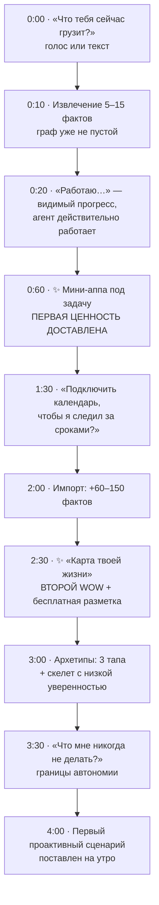

# Холодный старт: как наполнить life graph, не убив онбординг

> Ты правильно опознал это как главный барьер. Но диагноз надо уточнить: проблема не в том, что «граф трудно наполнить». Проблема в том, что **сама постановка «сначала наполним граф, потом польза» гарантированно убивает продукт.**

---

## 1. Переворот постановки

**Как ты сформулировал:** высокий порог входа — первичная настройка и наполнение life graph, надо придумать, как это решить.

**Что в этой формулировке ловушка.** Она подразумевает, что граф — предусловие для пользы. Пока это так, любое решение будет косметическим: анкету можно сделать красивой, разбить на шаги, добавить прогресс-бар — она всё равно останется анкетой между человеком и ценностью. Все продукты, которые пошли этим путём (персональные CRM, «второй мозг», лайф-трекеры), умерли в одном и том же месте: 70–90% отваливаются на настройке, а выжившие бросают на второй неделе, потому что поддержание данных — работа, а не польза.

**Правильная постановка:**

> **Граф — побочный продукт использования, а не предусловие для него.**

Это не смягчение задачи, а другая архитектура онбординга: ноль вопросов до первой ценности, и каждое последующее взаимодействие оставляет за собой факты.

Есть и приятное следствие: если граф — побочный продукт, то его наполненность становится **метрикой удержания**, а не барьером входа. Растёт граф — растёт качество — растёт удержание. Петля работает в нужную сторону.

---

## 2. Семь механик наполнения

Ни одна не является «формой». Каждая даёт факты, оставаясь либо невидимой, либо приятной.

### М1. Ноль вопросов до первой ценности

Первый экран — одно поле: **«Что тебя сейчас грузит?»** и кнопка микрофона. Ни регистрации-анкеты, ни выбора интересов, ни «расскажите о себе».

Уже из первой фразы извлекается 5–15 фактов. «Надо оформить визу в Италию к октябрю, и я вечно про это забываю» даёт: планируется поездка → страна → срок → нужна виза → паттерн «забывает про дедлайны» → скорее всего есть загранпаспорт → вероятен вопрос о других участниках поездки.

Разрешения запрашиваются **в момент очевидной пользы**, а не на старте: «Подключить календарь, чтобы я следил за сроками подачи?» — после того, как человек увидел мини-аппу.

### М2. Импорт вместо ввода

Три источника дают 60–80% полезного графа автоматически:

| Источник | Что извлекается |
|---|---|
| **Календарь** | люди (частые участники), места, ритмы, работа, регулярные события, дети (школа, кружки), врачи, поездки |
| **Контакты** | ближний круг, роли, семейные связи по фамилиям и меткам |
| **Почта (только чтение)** | подписки и списания, брони, документы и сроки, покупки, организации, страховки, платёжные ритмы |

Почта — самый недооценённый источник. Чеки, подтверждения броней, уведомления о продлении, счета: это структурированная летопись быта человека, которую он сам никогда бы не надиктовал.

> ⚠️ Всё содержимое почты и веба идёт **только** через карантинный экстрактор без инструментов (см. `02-tech-critique.md`, п. 7). Письмо — недоверенный ввод по определению.

### М3. «Карта твоей жизни» — wow и разметка одновременно

После импорта показываем то, что поняли: люди, ритмы, обязательства, ближайшие сроки. Красиво, обзорно, с провенансом у каждого факта («знаю из календаря»).

Двойная выгода:
- **Для пользователя** — второй wow-момент, и он же момент, когда человек впервые верит, что продукт про него.
- **Для нас** — самая дешёвая разметка в мире. Каждое исправление — это подтверждённый факт с максимальной уверенностью и обучающий сигнал для экстрактора.

Правки должны занимать один тап: «не так» / «уже неактуально» / «это важно».

### М4. Голосовое интервью вместо формы (опционально, 3 минуты)

Если человек хочет ускорить — не форма, а разговор. Голосовой ввод даёт кратно более полные ответы, чем поля: люди говорят подробностями, которые никогда бы не напечатали.

Семь вопросов, дающих 40–60 фактов:
1. Расскажи про обычную неделю — что повторяется?
2. Кто рядом — семья, кто от тебя зависит?
3. Что сейчас в работе, что тянется и не двигается?
4. Что регулярно забываешь или откладываешь?
5. На что уходит время, которое жалко?
6. Что должно случиться в ближайшие 3 месяца?
7. Что я не должен делать никогда?

Последний вопрос ценнее остальных: он задаёт границы автономии и сразу снимает тревогу.

### М5. Priors по архетипу

Человек выбирает 2–4 карточки, описывающие его: «родитель школьников», «много летаю», «снимаю квартиру», «есть машина», «забочусь о родителях», «фрилансер».

Каждая карточка предзаполняет **скелет графа с низкой уверенностью**: у родителя школьников есть учебный год, каникулы, медсправки, кружки; у автомобилиста — ОСАГО, ТО, штрафы, сезонная резина.

Опровергать легче, чем заполнять. Система начинает с осмысленных гипотез и уточняет их по ходу — вместо того чтобы начинать с пустоты. Ключевое: у таких фактов `confidence` низкая и `source = inferred`, они никогда не подаются как знание («у тебя ведь ОСАГО в ноябре?» — а не «твоё ОСАГО истекает в ноябре»).

### М6. Just-in-time профилирование

Задача спрашивает **только то, что нужно ей прямо сейчас**, и запоминает навсегда.

Плохо: «Заполните профиль семьи» на старте.
Хорошо: при первой задаче про поездку — «Летишь один или с кем-то?» Ответ навсегда оседает в графе.

Правило: **не больше одного уточняющего вопроса на задачу.** Если модели не хватает данных для двух вопросов — она обязана сделать разумное допущение, показать его явно и дать поправить в результате. Допущение, которое видно и правится, стоит дешевле вопроса.

### М7. Вопрос дня по неопределённости

Граф знает, где у него дыры и какие из них дорого обходятся. Раз в день, в подходящий момент (после успешно закрытой задачи — когда доверие на пике), задаётся один вопрос, закрывающий самую ценную дыру.

Приоритет дыры = сколько задач она блокирует × частота обращений × дешевизна вопроса.

### М+ Бонус: скриншот домашнего экрана

Необязательная механика с высоким выходом: «покажи свой рабочий стол». По набору иконок видно, какими сервисами человек пользуется — банк, доставки, такси, авиакомпании, спорт, медицина. Это карта его джоб и сервисов, полученная за один тап.

Годится и как источник фактов, и как способ понять, какие интеграции строить дальше.

---

## 3. Как это складывается в первые 5 минут

Ключевое свойство схемы: **ценность на 60-й секунде, до единого вопроса о пользователе.** Всё остальное — уже после того, как человек поверил.

---

## 4. Целевая динамика графа

| Момент | Фактов | Откуда |
|---|---|---|
| После первой фразы | 5–15 | извлечение из речи |
| После импорта | 80–200 | календарь, контакты, почта |
| После архетипов | +30–60 | priors с низкой уверенностью |
| Неделя 1 | 250–400 | + задачи и уточнения |
| Неделя 4 | 600–1000 | накопление + верификация priors |

**Метрика качества, а не объёма:** доля фактов с `confidence ≥ 0.8`, подтверждённых пользователем или несколькими источниками. Тысяча мусорных фактов хуже двухсот верных — потому что ассистент, ошибающийся уверенно, теряет доверие быстрее, чем ассистент, признающий незнание.

---

## 5. Гигиена графа

Наполнение — половина задачи. Вторая половина — не дать графу протухнуть.

1. **Затухание уверенности.** Факты, которые давно не подтверждались, теряют уверенность со временем. Разные скорости для разных предикатов: место работы затухает медленно, «сейчас читаю книгу X» — быстро.
2. **Перепроверка при использовании.** Если задача опирается на факт с уверенностью ниже порога — он показывается в результате как допущение с возможностью поправить одним тапом.
3. **Периодическая ревизия.** Раз в месяц — короткий обзор «что изменилось?» по фактам с самым большим сомнением. Не аудит всего графа, а 3–5 карточек.
4. **Право на забвение.** Удаление сущности каскадится по фактам, эмбеддингам и кэшам. Отдельный экран «что ты обо мне знаешь» с экспортом и удалением — это и требование закона, и, в продукте про личную жизнь, сильный аргумент доверия.

---

## 6. Чего делать нельзя

| Анти-паттерн | Почему смертельно |
|---|---|
| Анкета на старте | 70–90% отвала до первой ценности |
| Прогресс-бар «профиль заполнен на 40%» | превращает пользу в домашнее задание |
| Запрос всех разрешений на первом экране | максимальное недоверие в момент минимального знакомства |
| Больше одного уточняющего вопроса на задачу | ощущение допроса вместо помощи |
| Подача выведенных фактов как достоверных | одна уверенная ошибка стоит дороже десяти признаний незнания |
| Требование «настроить» перед использованием | это работа, а продукт продавался как избавление от работы |
